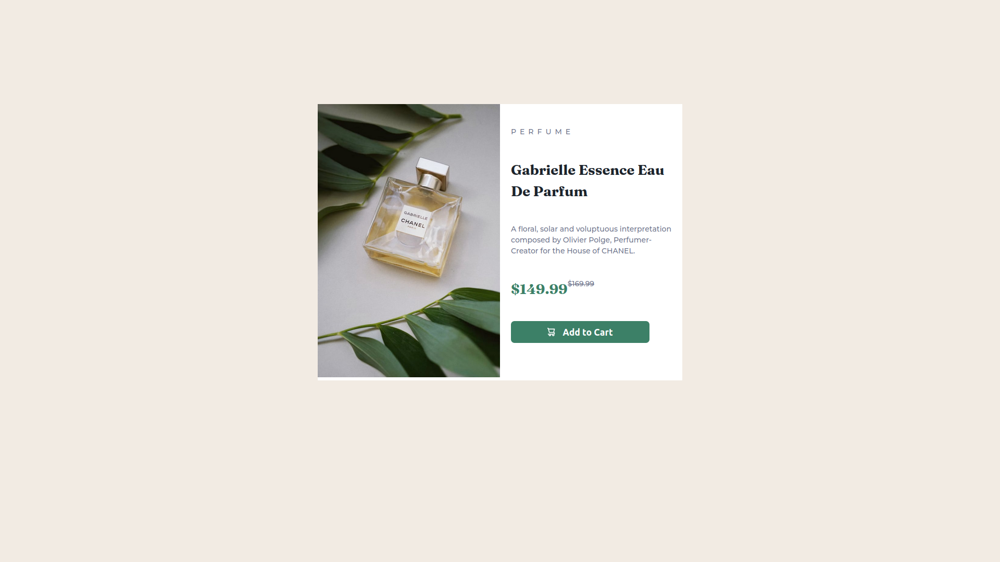

# Frontend Mentor - Product preview card component solution

This is a solution to the [Product preview card component challenge on Frontend Mentor](https://www.frontendmentor.io/challenges/product-preview-card-component-GO7UmttRfa). Frontend Mentor challenges help you improve your coding skills by building realistic projects.

## Table of contents

- [Overview](#overview)
  - [The challenge](#the-challenge)
  - [Screenshot](#screenshot)
  - [Links](#links)
- [My process](#my-process)
  - [Built with](#built-with)
  - [What I learned](#what-i-learned)
- [Author](#author)

## Overview

### The challenge

Users should be able to:

- View the optimal layout depending on their device's screen size
- See hover and focus states for interactive elements

### Screenshot



### Links

- Solution URL: [Click here!](https://github.com/medaich/product-preview-card-component-main)
- Live Site URL: [Click here!](https://medaich.github.io/product-preview-card-component-main/)

## My process

### Built with

- Semantic HTML5 markup
- CSS custom properties
- Flexbox
- CSS Grid
- Mobile-first workflow

### What I learned

I learnd how to use picture tag to change media on each device, it's the easiest way to do this.
here where I used it.

```html
<picture>
  <source
    srcset="images/image-product-desktop.jpg"
    media="(min-width: 700px)"
  />
  
</picture>
```

## Author

- Frontend Mentor - [@medaich](https://www.frontendmentor.io/profile/medaich)
- X (Twitter) - [@medaichx](https://www.x.com/medaichx)
